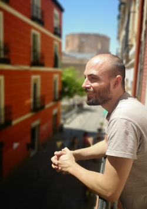

---
# Feel free to add content and custom Front Matter to this file.
# To modify the layout, see https://jekyllrb.com/docs/themes/#overriding-theme-defaults

layout: home
permalink: /home/
sitemap: true
---

I am a Postdoctoral Scholar at the Technical University Munich and part of the [Munich Econometrics Group](https://munichmetrics.de/).

My research interests are:

  * Semi-parametric Inference
  * Machine Learning
  * Inequality of Opportunity
  * Empirical Welfare Maximization
  * U-statistics and U-processes

[CV](https://raw.githubusercontent.com/joelters/website/gh-pages/assets/cv.pdf)

[Google Scholar](https://scholar.google.com/citations?user=NDAc42oAAAAJ&hl=es&oi=ao)
