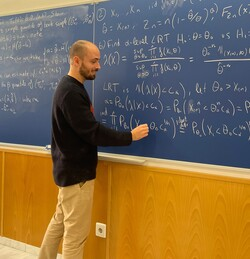

{: style="float: right"}

## Undergraduate

  - Quantitative Microeconomics (Fall 2019), TA, UC3M
  - Introduction to Mathematics for Economics (Fall 2019), TA, UC3M
  - Econometrics (Spring 2020,2021), TA, UC3M
  - Mathematics for Economics II (Spring 2022), TA, UC3M
  - Machine Learning, Causal Discovery and Experimentation (Fall 2025), TUM

## Graduate 

  - Introduction to statistics (Fall 2020, 2021), TA, MRes in Economic Analysis UC3M
  - Econometrics I (Fall 2020, 2021, 2022), TA, MRes in Economic Analysis UC3M
  - Applied Economics (Fall 2020), TA, MRes in Economic Analysis UC3M
  - Microeconometrics (Spring 2022), TA, Master in Industrial Economics and Markets UC3M
  - PhD course: Local Robustness and Machine Learning (Spring 2025), TUM
